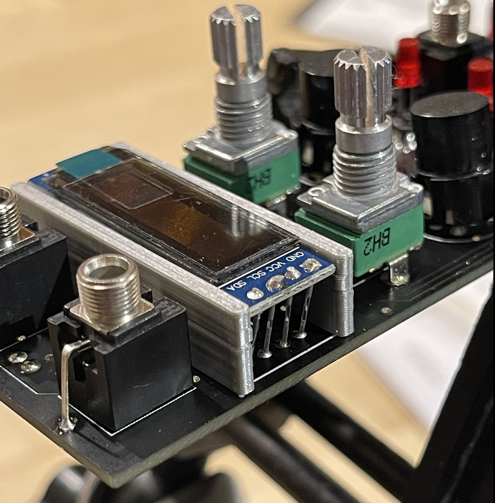
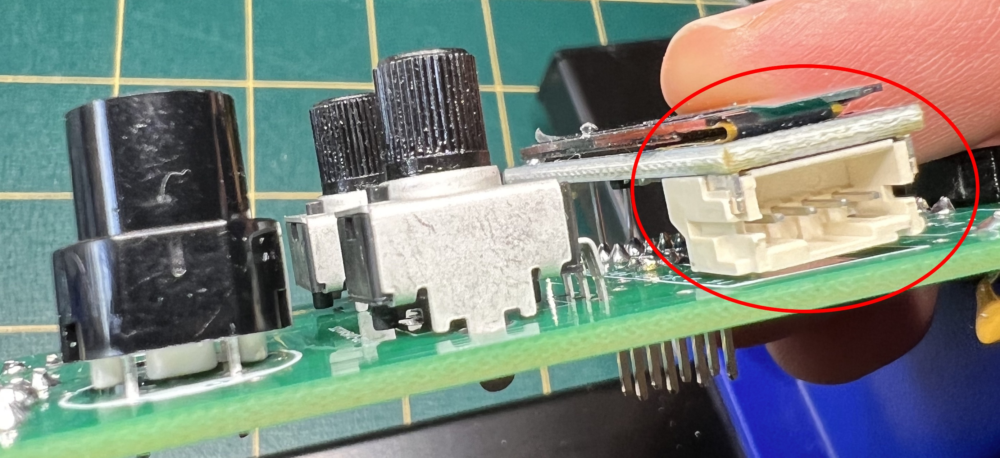
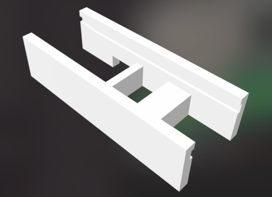

# 3D printed OLED stands

A simple small stand for your OLED display. This helps hold it in place while soldering and keeps it snug against the face of the module. 

> There are two versions of the stand, one for the CPC style OLED and one for the TPH (the Pi Hut) style OLED.

## CPC style OLED

3D print the file [OLED_Stand.stl](OLED_Stand.stl).

Put the stand on something about 5-10mm tall, then solder some component cutoff wire to your OLED so that they fall below the bottom of the stand. Place on your interface board, solder pins to board. Pins may need to be bent slightly for the model of OLED that you're using. Just align the stand and the display and you should be right in the middle of the cutout.

Print upside down for best results/least amount of supports. Should print very quickly on most printers. It takes 30 minutes on an Ender3 Pro.

 

## TPH (the Pi Hut) style OLED

3D print the file [OLED_Stand_Pi_Hut.stl](OLED_Stand_Pi_Hut.stl).

The TPH (the Pi Hut) OLED needs a different stand because it has a chunky connector on the side (unused by the EuroPi).

 

- Slide your OLED into the groove. 
- Place the stand with OLED into position on the PCB (hold in place using bluetack).
- Solder the four vertical wires. 

The stand has a notch to avoid certain soldering points. You should keep the stand permanently in your EuroPi for added stability of the screen.

 
