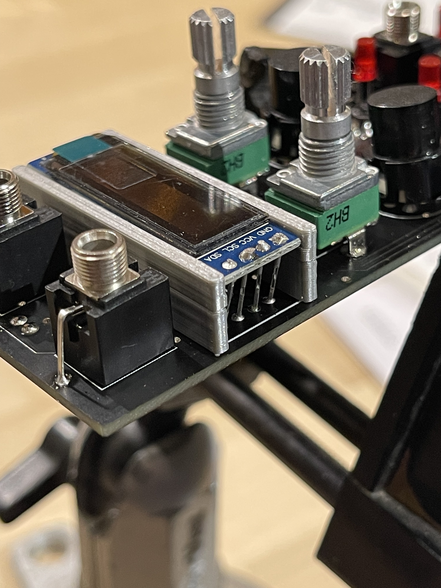

A simple small stand for your OLED display. This helps hold it in place while soldering and keeps it snug against the face of the module. Put the stand on something about 5-10mm tall, then solder some component cutoff wire to your OLED so that they fall below the bottom of the stand. Place on your interface board, solder pins to board. My pins needed to be bent slightly for the model of OLED that I'm using. Just align the stand and the display and you should be right in the middle of the cutout.

Print upside down for best results/least amount of supports. Should print very quickly on most printers. It takes 30 minutes on my Ender3 Pro.

The 'parametric-ish' Blender file is included in case you'd like to mod it. 

 
 
 
"https://raw.githubusercontent.com/aTanguay/EuroPi/main/hardware/OLED_Stand/OLED_Stand_01.jpg
