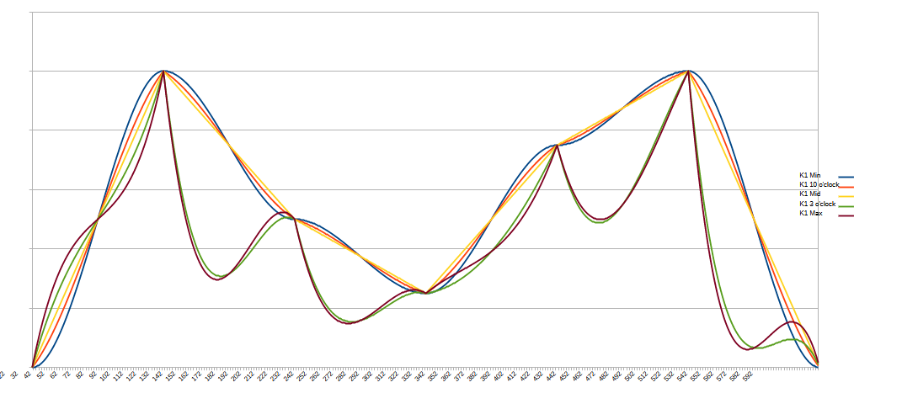

# Bezier Curves

This script generates two random CV outputs using [Bezier curves](https://en.wikipedia.org/wiki/Bezier_curve).

This work is inspired by the [ADDAC507](https://www.addacsystem.com/en/products/modules/addac500-series/addac507),
a collaboration between ADDAC System and [Monotrail](https://youtu.be/9PxVmeMrOoQ?si=GsNDKNipjHtBIPT1)

## Input & Output

The module has two separate output channels, referred to as A and B. Each has identical controls, though channel B's
controls can only be accessed by holding `b2`.  Note that when changing channels, the knobs will "lock" in their
previous positions, so you may need to sweep the knob to unlock it.

- `b1` -- press to change the clipping mode for both channels (see below)
- `b2` -- hold to change `k1` and `k2` to channel B input

- `k1` -- set the frequency of channel A or B
- `k2` -- set the curve of channel A or B
- `ain` -- configurable CV input to control either the frequency or curve (see below for how to set routing)
- `din` -- unused

- `cv1` -- CV output from channel A
- `cv2` -- CV output from channel B
- `cv3` -- the average of channel A and B CV outputs
- `cv4` -- gate output of channel A
- `cv5` -- gate output of channel B
- `cv6` -- logic combination of gate outputs of channels A and B (see below for how to configure the logic mode)

Gate outputs are different for channels A and B:
- Channel A (`cv4`) outputs a 10ms trigger every time a new sample is generated (determined by the frequency)
- Channel B (`cv5`) is high whenever its voltage output is higher than 50%. e.g. if the range is set to 0-10V, `cv5`
  will be high if `cv2` is 5V or more.

## Additional Configuration

The script has additional parameters that can be set by manually editing/creating `/config/Bezier.json`. The default
values for this file are below:

```json
{
    "MIN_VOLTAGE": 0.0,
    "MAX_VOLTAGE": 10.0,
    "AIN_MODE": "frequency",
    "LOGIC_MODE": "xor",
    "MAX_INPUT_VOLTAGE": 10.0
}
```

The following fields may be set:

- `MIN_VOLTAGE` -- the minimum voltage that channel A or channel B may output. Default: 0.0
- `MAX_VOLTAGE` -- the maximum voltage that channel A or channel B may output. Default 10.0
- `AIN_MODE` -- changes what parameter voltage to `ain` controls. Must be one of `curve` or `frequency`. Default: `frequency`
- `LOGIC_MODE` -- sets the logical operation used to determine the gate output of `cv6`. Must be one of
   `and`, `or`, `xor`, `nand`, `nor`, or `xnor`. Default: `xor`.
- `MIN_FREQUENCY` -- the minumum frequency (Hz) for choosing new random values. Must be between 0.001 and 10.0. Default: 0.01
- `MAX_FREQUENCY` -- the maximum frequency (Hz) for choosing new random values. Must be between 0.001 and 10.0. Default: 1.0
- `MAX_INPUT_VOLTAGE` -- the maximum CV input voltage (default: 10.0)

Note that the maximum and minimum voltages must be defined such that:
- `MIN_VOLTAGE` is less than `MAX_VOLTAGE`
- `MIN_VOLTAGE` and `MAX_VOLTAGE` are positive
- `MIN_VOLTAGE` and `MAX_VOLTAGE` do not fall outside the range defined by the module's master configuration
  (see [Configuration](/software/CONFIGURATION.md) for more information)

## Clipping mode

The output can behave in one of 3 ways if the output wave moves outside the defined maximum/minimum voltage range:
- `limit` -- the output is clipped to the maximum/minimum value
- `fold` -- the output is flipped such that the shape of the curve is reflected
- `thru` -- the output wraps around through the opposite end of the range

## Curve Shapes

The following graph shows an example of the generated curves with different values set for `k1`:


## CV Control

If CV control is set to `frequency` (the default), `ain` will accept 0-10V, increasing the frequency of both channels
as voltage increases.

If CV control is set to `curve`, `ain` will accept 0-10V, changing the curve constant of both channels. The channels'
curve constants are set to the average between the knob value (`[-1, 1]`) and the CV value:
- `0V` is equivalent to a curve constant of `-1`
- `5V` is equivalent to a curve constant of `0`
- `10V` is equivalent to a curve constant of `+1`

The voltage range of 0-10V can be configured (see above) if your system cannot generate 10V voltages
