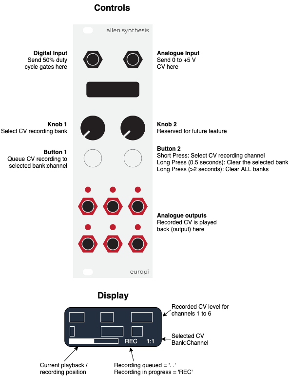

# CVecorder

CVecorder ("Sveecorder") is a 6 bank, 6 channel CV recording and playback program that runs on the
EuroPi from [Allen-Synthesis](https://github.com/Allen-Synthesis/EuroPi). It can be used to control
the CV of any module in a really fine-grained way, rather than spending time creating CV patterns
with sequencers, envelopes or LFOs, you simply record the exact CV pattern you want and have this
played back into your modules.

Also, because CVecorder has 6 banks you can record 6 different variations of 6 channels of CV, then
smoothly change between them during a performance without skipping a beat!

Note, due to limitations in the Raspberry Pi pico (the hardware running behind the EuroPi), only
positive CV can be recorded and played back.

Demo video: https://youtu.be/Crj0P7pr2YA

## Controls and Display

## Getting Started

The following sections provide instructions for recording and playing back CV using CVecorder.

### Initial Connections
1. Connect a 50% duty cycle gate input to the Digital input
2. Connect a CV source to the analogue input (0 to +5V works best)
3. Connect each output (1 to 6) to modules you want to send CV to

### Recording and Playing back CV
CVecorder records CV using the following format:
- Each CV channel records a total of 64 CV values (samples).
- Two CV samples are recorded for each received gate. One sample is captured on the rising edge,
  another on the falling edge.
- Each CV channel is looped with every 32nd gate into the Digital input.
- Each CV sample is captured with a resolution of 0 - 9.99, providing a resolution of 1000 potential
  CV values to record.
- Each CV channel relates directly to each output. CV channel 1 sends the recorded CV to output 1,
  CV channel 2 to output 2 and so on.
- There are 6 banks of 6 CV channels, allowing you to record 6 variations of CV recordings in each
  bank and move smoothly between them during a performance.

To record and playback CV:
1. Send a 50% duty cycle gate to the Digital input, this will automatically start the CVecorder. You
   will see this on the display on the bottom left-hand side.
2. Select the required bank using knob 1
3. Select the required channel using button 2
4. Press button 1 to queue CV recording to the selected bank:channel. You will see indicator at the
   bottom of the screen change to '. .' , CV recording will start at the beginning of the CV
   channel. 'REC' will be displayed when recording has started.
5. At the end of the channel, the recorded CV is output from the corresponding output.
6. Select the next required CV channel using button 2, then repeat step 4.
7. Once you have everything the way you want it on bank 1, select the next bank using knob 1 and
   record your next set of 6 CV channels to the next bank.
8. During your performance, you can move smoothly between each CV bank using knob 1. This allows you
   to switch between 6 variations of CV to all 6 outputs.

## Saving CV between power cycles
Every time you record a new CV channel, CV is automatically saved to local storage on the Raspberry
Pi pico. This means that you can power off your module at any time (other than during the recording
of a channel) and it will always be available when you power back up.

To overwrite saved CV simply record over it. However, if you would prefer to clear an entire bank or
all banks use button 2 - see 'Clearing banks' for more info.

### Clearing banks and channels
If you want to update the CV recorded into a channel, simply record over it. To clear a bank, repeat
this process for all channels in the bank. However, if you would rather clear a channel completely
hit record and send no CV into the channel during the recording period.

## Patching ideas

### Painting quantized melodies

This patch allows you to paint melodies using a CV source like a joystick.
CV is recorded and played back by the CVecorder, which is quantized to scale and sent to a VCO.

1. Connect a 50% duty cycle gate to the Digital input
2. Connect a CV source to the analogue input (0 to +5V works best) for example a joystick

If your quantizer has a trigger input:

3. Mult / Divide the gate input and connect to the quantizer trigger input. This will sample CV from
   the CVecorder each time it receives a gate
4. Connect CVecorder output 1 to the quantizer input
5. Connect the quantizer output to a VCO
6. Play around with subtle movements on your CV controller and hear the melodies come out of your
   VCO!

If your quantizer has no trigger input:

3. Mult / Divide the gate input and connect to a sample and hold trigger/clock input
4. Connect CVecorder output 1 to a sample and hold CV input
5. Connect the sample and hold output the quantizer input
6. Connect the quantizer output to a VCO

### Extreme FX control

This patch provides super-granular control of FX modules, allowing you to control the value of each
FX parameter up to two times with each clock cycle. Doing this can create both smooth and whacky FX
changes.

1. Connect a 50% duty cycle gate to the Digital input
2. Connect a CV source to the analogue input (0 to +5V works best) for example a joystick
3. Connect each of the outputs to parameters on your FX module
4. Play around with different combinations of CV across the different channels to have fine-grained
   control of your FX CV parameters

### Creating percussion variations

This patch allows you to add interesting variations to your percussion.

1. Connect a 50% duty cycle gate to the Digital input
2. Connect a CV source to the analogue input (0 to +5V works best) for example a joystick
3. Connect each of the outputs to parameters on your percussion modules, for example connect to
   inputs that control pitch, accents, timbre or sample.
4. Play around with different combinations - if it sounds good stick with it!
