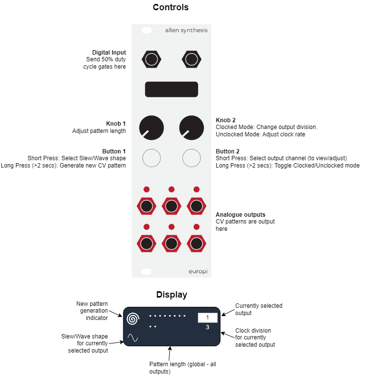
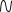

# Egressus Melodiam

Egressus Melodiam ("Stepped Melody") is a clockable and free-running LFO and random CV pattern
generator. Eight different wave shapes either define the LFO shape or the slew shape between CV
pattern steps. Use it to generate variable length melodies (using a quantizer), LFOs or weird and
wonderful control voltages.

## Demo Video

https://youtu.be/_qlnV_ewb_c

## Inputs, Outputs and Controls

Analogue outputs send a voltage from 0V to the maximum configured output voltage
(`MAX_OUTPUT_VOLTAGE`) as defined by europi_config. The default maximum output voltage is +10V.

## Getting started

1. Patch a 50% duty cycle square wave or clock with pulses >= 16ms in duration into the digital
   input
2. Connect one or more outputs to an input on another module (e.g. CV modulation inputs)
3. Select a pattern length using Knob 1
4. Start your clock. Each output will now send a looping CV pattern to your module!

So, what happened in the above example? When the module first powered on it automatically generated
6 x 32 step random CV patterns - one for each of the 6 outputs. Each time a clock is received, the
step advances by one step and then loops when it get to the end of the pattern. The length of the
pattern loop is controlled using knob 1, which supports a value from 1 to 32.

## Changing the slew/wave shape and clock division of an output

Refer to the above diagram for a visual representation of the example below.

1. Press and release button 2 until the output number you would like to edit is shown on the
   top-right.
2. Press button 1 to cycle through the available wave shapes
3. Adjust knob 2 to select the output division. An output division of 1 causes the CV pattern / LFO
   for that output to run at the clock rate. An output division greater than one reduces the CV
   pattern / LFO to run at the selected division (e.g. selecting a division of 2 would run at half
   the clock rate)

In LFO mode (pattern length of 1) the wave shape determines the shape of the cycling LFO. However,
when in CV pattern mode (Pattern length > 1) the wave shape determines the slew between pattern
steps.

### Available Slew/wave shapes

Eight shapes are available. Some are symmetrical where the rising shape is the same as the falling
shape, others are asymmetrical.

-  **Square/Step**: Moves
  up/down immediately and holds until the next step
-  **Triangle/Linear**: A
  straight line between steps
-  **Sine/Smooth**: A smooth
  line between steps using a sine wave
- 
  **Exponential up and down**: An exponential curve between steps. This rises/falls slowly at the
  start and fast at the end
-  **Sharktooth**:
  Logarithmic rise, exponential fall. A logarithmic curve rises/falls quickly at the start and
  slowly at the end.
- 
  **Reverse Sharktooth**: Exponential rise, Logarithmic fall.
- 
  **Logarithmic up, step down**: Upward transitions are logarithmic, downward transitions are
  stepped.
- 
  **Step up, exponential down**: Upward transitions are stepped, downward transitions are
  exponential.

## Generating a new CV pattern for an output

A new CV pattern is generated for the selected output by holding down button 1 for 2 seconds and
releasing. An indicator is shown on the top left of the screen to show a new CV pattern has been
generated. Note that if you are in LFO mode (pattern length of 1) this function will have no effect
until the pattern length is increased.

## LFO Mode / CV Pattern mode

Selecting a pattern length of 1 will output an LFO.
Selecting a pattern length greater than one plays through the generated CV patterns.
Slew is generated between CV pattern steps when a wave shape other then square is selected.

## Clocked / Free-running mode

Clocked mode is selected by default - indicated by showing the length of the CV pattern (in dots)
in the middle of the screen. To enter free-running mode, hold button 2 for 2 seconds and release.
The configured clock rate in milliseconds is shown
in the middle of the screen to indicate you are in free-running mode.

Note that when in free-running mode, the previously selected pattern length remains unchanged, it
is therefore a good idea to select the required pattern length before changing to unclocked mode.

## Saving and loading

All settings and CV patterns are saved when changes are made and will not be lost when the module
is powered off.

## Changing the maximum CV voltage

CV Patterns (including LFOs) output a range of 0-10V based on the default globally configured value.
If you would like to change this value, see [configuration](../CONFIGURATION.md#io-voltage) for
details on changing EuroPi's output voltages.
