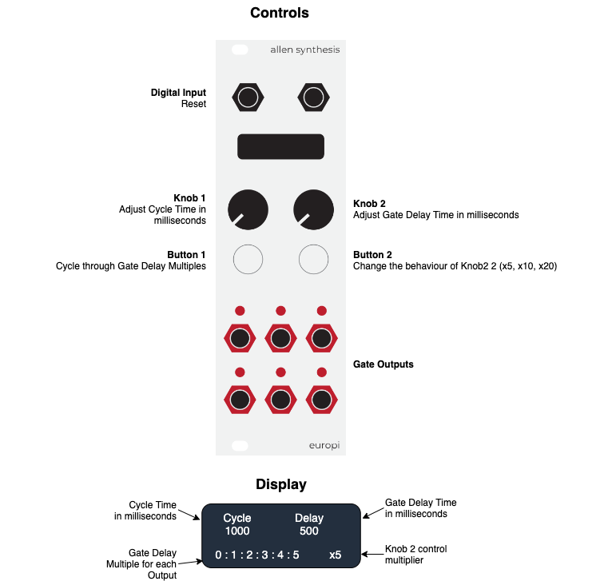

# Gate Phaser

author: Nik Ansell (github.com/gamecat69)

date: May 2024

labels: sequencer, gates

A script which attempts to answer the question "What would Steve Reich do if he had a EuroPi?".

Gates are sent from outputs 1-6 which are offset (or out of phase) with each other. This creates a group of gates that drift in and out of phase with each other over time.

You can use this script to create Piano Phase type patches, dynamic rhythms which evolve over time and eventually resolve back in phase, or ... well lots of other things that would benefit from having gates which are delayed from each other.

Demo Video: https://www.youtube.com/watch?v=fnpH8Q6sxIM

# Inputs, Outputs and Controls

  
# Getting started

1. Patch anything you want to trigger with a gate to any of the outputs, for example
percussions elements, emvelopes, sequencer clocks or samples.
2. Set the Cycle time in milliseconds using knob 1
3. Set delay time in milliseconds using knob 2
4. Set the desired gate delay interval using button 1
5. Use button 2 to change the behaviour of knob 2 to set the desired gate delay time

# So what is this script actually doing?

**Cycle time** is the time in milliseconds between gate outputs at output 1 when the gate delay multiple for output 1 is set to 0.

**Gate delay** is the time in milliseconds that gate outputs are delayed from the master cycle time.

**Gate multiples** are multiples of the gate delay time per output.

## For Example:

- Cycle Time: 1000ms
- Gate Delay Time: 500ms
- Gate Delay Multiples: 0:1:2:3:4:5

The initial output is sent after "Gate Delay Time * Gate Delay Multiple" milliseconds.
Each subsequent output is sent after "Cycle Time + (Delay Time * Gate Delay Multiple)" milliseconds.

Therefore after the initial gate output from each output:

- Output 1 sends a gate every 1000ms 
- Output 2 sends a gate every 1500ms
- Output 3 sends a gate every 2000ms
- Output 4 sends a gate every 2500ms
- Output 5 sends a gate every 3000ms
- Output 6 sends a gate every 3500ms

Which results in the following:

| Output |   t0    | 500ms   | 1000ms  | 1500ms  | 2000ms  | 2500ms  | 3000ms  | 3500ms  | 4000ms  |
|--------|---------|---------|---------|---------|---------|---------|---------|---------|---------|
|   1    |    x    |         |    x    |         |    x    |         |    x    |         |    x    |
|   2    |         |    x    |         |         |    x    |         |         |    x    |         |
|   3    |         |         |    x    |         |         |         |    x    |         |         |
|   4    |         |         |         |    x    |         |         |         |         |    x    |
|   5    |         |         |         |         |    x    |         |         |         |         |
|   6    |         |         |         |         |         |    x    |         |         |         |

