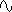
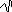

# Lutra

Lutra is a re-imagining of [Expert Sleepers' Otterley](https://expert-sleepers.co.uk/otterley.html)
module.

Each output channel is a free running LFO with a subtly different clock speed. The spread of clock
speeds is controlled by `k2` (and optionally `ain` -- see configuration below)

## Inputs & Outputs

Inputs:
- `din`: synchronization CV input (see [Re-Syncing](#re-syncing) below)
- `ain`: configurable CV input (see [CV Input Configuration](#cv-input-configuration) below)
- `k1`: primary speed control; rotating clockwise increases the speed of all LFOs
- `k2`: primary spread control; rotating clockwise increases the spread between LFO speeds
- `b1`: manual reset input (see [Re-Syncing](#re-syncing) below)
- `b2`: wave shape selector (see [Wave Shapes](#wave-shapes) below)

Outputs:
- `cv1`-`cv6`: LFO outputs

## Wave Shapes

The shape of the output wave can be changed by pressing `b2` while the module is running. This
choice is saved to the module and will be re-loaded every time `Lutra` starts. Available wave
shapes are:
-  Sine
-  Square
-  Triangle
-  Saw
-  Ramp
-  Stepped Random
-  Smooth Random (Linear)

When pressing `b2` to select the wave shape, the selected shape will briefly appear in the upper
left corner of the screen.

The stepped random wave will hold a randomly-chosen voltage for the duration of the cycle period,
choosing a new voltage every period.

The smooth random wave moves linearly from the current voltage toward a randomly-chosen goal over
the cycle period, choosing a new random goal voltage every period.

## Knob Control

Turning `k1` fully anticlockwise will set the clock speed to the slowest setting. Turning `k1` fully
clockwise will set the clock speed to the fastest setting.

Turning `k2` fully anticlockwise will set the spread of the waves to zero; every output will have
the same clock speed, (though depending on previous settings and random noise) they may be
phase-shifted from each other.

Turning `k2` clockwise will gradually increase the speed of `cv2-6`, with each output becoming
slightly faster than the previous one. i.e. `cv2` will be faster than `cv1`, `cv3` will be faster
than `cv2`, etc...

At the maximum clockwise position, the speeds of `cv2-6` will be common harmonic intervals from
`cv1`, as shown on the table below:

| CV Output | Ratio w/ `cv1 | Max speed multiplier |
|-----------|---------------|----------------------|
| `cv1`     | 1:1           | x1                   |
| `cv2`     | 6:5           | x1.2                 |
| `cv3`     | 5:4           | x1.25                |
| `cv4`     | 4:3           | x1.3333...           |
| `cv5`     | 3:2           | x1.5                 |
| `cv6`     | 2:1           | x2                   |

## Re-syncing

When `b1` is pressed or `din` receives a high voltage all CV outputs are temporarily halted. Once
`b1` is released _and_ the signal on `din` drops back to `0.0V` the output signals will begin again,
starting in their initial, synchronized state. This allows a very short gate (trigger) signal to
reset all of the waves to re-synchronize them, or a longer gate can be used to hold the outputs at
zero for as long as desired.

## CV Input Configuration

By default CV signals applied to `ain` will adjust the spread of the output waves.  If preferred,
this can be changed to control the overall speed of the waves instead by creating/editing
`/config/Lutra.json` on the module.

```json
{
    "AIN_MODE": "spread"
}
```

- `AIN_MODE`: sets the mode for `ain`. Must be one of `spread` or `speed`.  If set to `spread` the
  spread of clock speeds of the outputs is controlled by `ain`.  If set to `speed` the master clock
  speed is controlled by `ain`.

`ain` is expected to receive signals from zero to `MAX_INPUT_VOLTAGE` (default 12V -- see
[EuroPi configuration](/software/CONFIGURATION.md)).  Increasing the voltage will increase the speed
or spread of the LFOs.  Decreasing the speed/spread is not allowed, as EuroPi cannot accept negative
voltages.  Instead it is recommended to set `k1` and `k2` to set the minimum desired speed & spread
with `ain` unpatched. Then send an attenuated signal into `ain` to increase the speed/spread as
desired.
