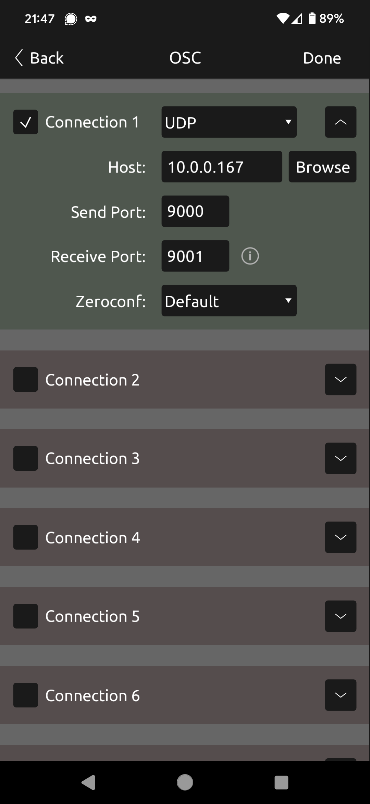
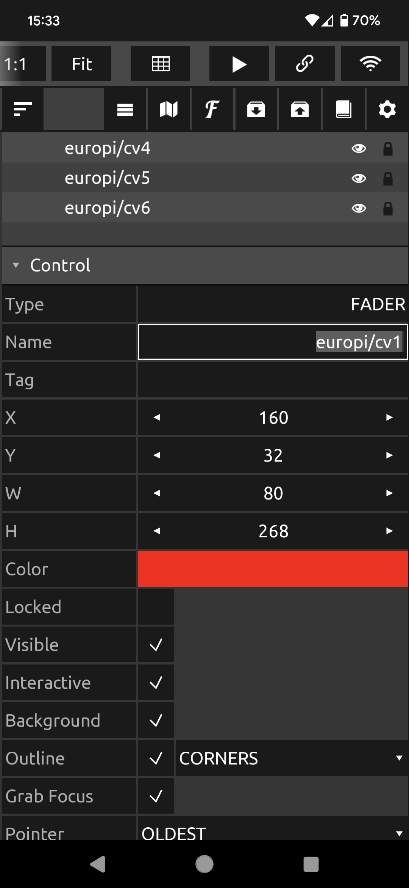
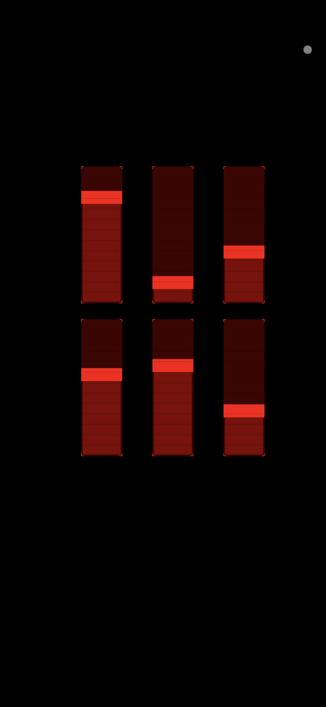
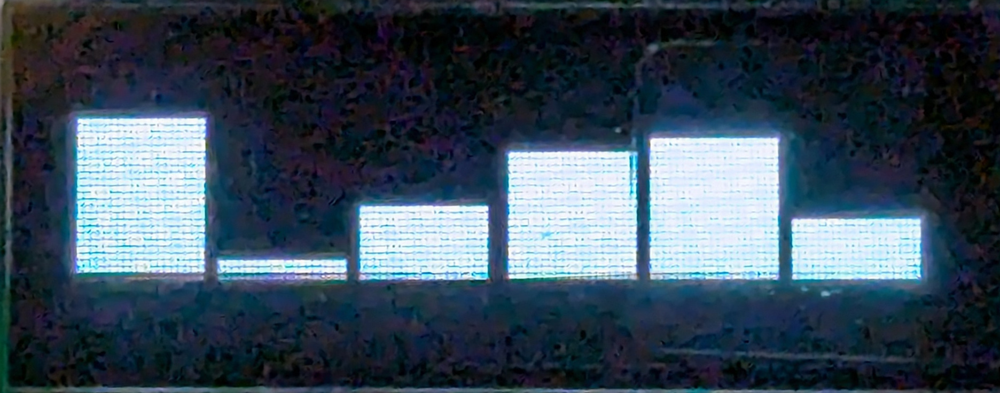

# Open Sound Control (OSC) Interface

This program allows the use of Open Sound Control packets over UDP to control
EuroPi.

## OSC Addresses

The following addresses are used by the program (noting that the `/europi` namespace
can be changed; see below):

- `/europi/cv1`
- `/europi/cv2`
- `/europi/cv3`
- `/europi/cv4`
- `/europi/cv5`
- `/europi/cv6`

All of the above will accept float or integer data. Floats are treated as the 0-1
level for CV control. Integers are treated as boolean on/off signals (0 for off, anything
else for on).

- `/europi/cvs`

The above accepts 6 parameters of either float or integer, and will set all 6 outputs
with a single packet.

In addition to the input addresses above, EuroPi will broadcast the following addresses
at 20Hz:

- `/europi/ain`: float, the 0-1 input level
- `/europi/k1`: float, the knob position as a value in the range 0-1
- `/europi/k2`: float, the knob position as a value in the range 0-1
- `/europi/din`: integer, a 0/1 value indicating if the input is off or on
- `/europi/b1`: integer, a 0/1 value indicating if the button is pressed or not
- `/europi/b2`: integer, a 0/1 value indicating if the button is pressed or not

## Multiple EuroPi on the same network

If you have more than one EuroPi you may find it desirable to assign each their own
namespace. Otherwise by moving one fader on your OSC input device you may control
all EuroPis at once.

Create `/config/OscControl.json` to set the namespace:

```json
{
    "NAMESPACE": "/europi_1"
}
```

If the namespace does not start with `/`, a `/` will automatically be added.  If the namespace
is left empty, it will default to `/`.

## Changing the topics

The input & output topics described above are defaults. To rename the topics (e.g. to facilitate
easier interaction with other devices) the topics can be customized by specifying the topics for
each output: `/config/OscControl.json`:

```json
{
    "CV1_TOPIC": "cv1",
    "CV2_TOPIC": "cv2",
    "CV3_TOPIC": "cv3",
    "CV4_TOPIC": "cv4",
    "CV5_TOPIC": "cv5",
    "CV6_TOPIC": "cv6",
    "CVS_TOPIC": "cvs",

    "AIN_TOPIC": "ain",
    "DIN_TOPIC": "din",
    "K1_TOPIC": "k1",
    "K2_TOPIC": "k2",
    "B1_TOPIC": "b1",
    "B2_TOPIC": "b2",
}
```

If the topics begin with a `/`character, they are treated as absolute topic names. If they do not
start with `/` they will be included in the `NAMESPACE` defined above.

## Changing the port

TouchOSC uses UDP port 9000 by default, so that's what EuroPi looks for. To override
the default with a different port, set the port in `/config/OscControl.json`, e.g.:

```json
{
    "RECV_PORT": 6024
}
```

## Sending data

To configure the port & IP address that button, knob, `ain`, and `din` states are send,
set the `SEND_PORT` and `SEND_ADDR` keys in `/config/OscControl.json`, e.g.:

```json
{
    "SEND_ADDR": "192.168.4.100",
    "SEND_PORT": 9001,
}
```

## Configuring TouchOSC

[TouchOSC](https://hexler.net/touchosc) is a commercial program available for a variety
of platforms that allows you to create custom OSC input interfaces.

### Network setup

Press the link button to configure TouchOSC's connection to your EuroPi.

Select `UDP` as the connection type and enter the IP address of your EuroPi and
enter the following:
- `Host`: EuroPi's IP address
- `Send Port`: the `RECV_PORT` value configured on EuroPi; this is the port TouchOSC
  sends data, and the port that EuroPi correspondingly listens on
- `Receive Port`: the `SEND_PORT` value that you configured on EuroPi; this is the
  port TouchOSC listens for data on, and correspondingly the port EuroPi sends data on
- `Zeroconf`: leave as `Default` unless you have a specific requirement to change this



_Configuring TouchOSC's networking_

### UI setup

The simplest way to control EuroPi via TouchOSC is to add six sliders to your panel.
Then edit each slider to set its name to `europi/cvN` where `N` is the number `1` to
`6`.



_Configuring a slider's name in TouchOSC on Android_

Then configure TouchOSC's `OSC` connection to connect to your EuroPi's IP address. Your
phone/table must either be connected to EuroPi's access point, or both must be connected
to the same wifi network.

Once configured, start TouchOSC's interface by pressing the triangular "Play" button.



_TouchOSC's sliders_

EuroPi's OLED will show bars indicating the levels of TouchOSC's sliders



_EuroPi's OLED showing the same slider levels as TouchOSC_

## Using 8mu

If you have a [Music Thing Modular 8mu](https://www.musicthing.co.uk/8mu_page/)
you can use it to control EuroPi via OSC.

Refer to the [OSC 8mu interface](/software/desktop/osc_8mu.md) for details on
how to set up your computer to read 8mu's sliders and convert them to OSC
messages for EuroPi.
