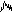

# Pam's "EuroPi" Workout

This program is an homage to [ALM's Pamela's "NEW" Workout](https://busycircuits.com/alm017/)
and [Pamela's "PRO" Workout](https://busycircuits.com/alm034/) modules, reimagined for the EuroPi.
It is intended to be used as a main clock generator, euclidean rhythm generator, clocked LFO,
clocked random voltage source, etc... with optional quantization.

The module itself will generate the master clock signal with a configurable BPM (1-240 BPM
supported). Each output has an independently controlled clock multiplier or divider, chosen from
the following:

```
[x16, x12, x8, x6, x4, x3, x2, x1, /2, /3, /4, /6, /8, /12, /16]
```

## I/O Mapping

| I/O           | Usage
|---------------|-------------------------------------------------------------------|
| `din`         | External control input (see below)                                |
| `ain`         | Routable CV input to control other parameters                     |
| `b1`          | Start/Stop input                                                  |
| `b2`          | Press to enter/exit edit mode. Long-press to enter/leave sub-menu |
| `k1`          | Routable CV input to control other parameters                     |
| `k2`          | Menu navigation                                                   |
| `cv1` - `cv6` | Output signals. Configuration is explained below                  |

If you accidentally press `b2` and enter edit mode, you can long-press `b2` to change
menu levels and cancel the current operation, without modifying the setting you had
selected.

`din` can be configured to operate in multiple modes:
- start/stop trigger
- run gate
- reset trigger

## Menu Navigation

Rotate `k2` to scroll through the current menu. Pressing and holding `b2` for 0.5s will
enter a sub-menu. Pressing and holding `b2` again will return to the parent menu.

On any given setting, pressing `b2` (without holding) will enter edit mode for that
item. Rotate `k2` to choose the desired value for the item, and press `b2` again
to apply it.

The menu layout is as follows:

```
Clock
 +-- BPM*
 |    +-- DIN Mode
 |    +-- Reset
 |
CV1
 +-- Mod.*
 |    +-- Wave Shape**
 |    +-- Wave Width (PWM/Symmetry)*
 |    +-- Phase*
 |    +-- Wave Amplitude*
 |    +-- Attack*
 |    +-- Decay*
 |    +-- Sustain*
 |    +-- Release*
 |    +-- Skip Probability*
 |    +-- Euclidean Steps*
 |    +-- Euclidean Triggers*
 |    +-- Euclidean Rotation*
 |    +-- Swing Percentage*
 |    +-- Quantization Scale*
 |    +-- Quantizer Root*
 |    +-- Mute
 |    +-- Save
 |    +-- Load
 |    +-- Reset
 |
CV2 to 6
 +-- Same as CV1
 |
AIN
 +-- Gain
 |    +-- Precision
 |
Visualization
```

`*` These settings can be automatically selected using voltage coming into `ain`.

`**` This setting can be set up to work as a sample & hold for the signal coming into `ain`.

Some settings (e.g. ADSR envelope parameters, quantization root) are hidden from the menu if they
would be ignored by the current configuration for that channel.

The vizualization does not have any submenu items and simply displays the voltages of `CV1`-`6`,
`AIN`, and `K1`.

## Main Clock Options

The main clock menu has the following options:

- `BPM` -- the main BPM for the clock. Must be in the range `[1, 240]`.

The submenu for the main clock has the following options:

- `DIN Mode` -- Control the action taken when a gate or trigger is sent to `DIN`:
  - `Gate`: the clock will start on a rising edge and stop on a falling edge
  - `Trigger`: the clock will toggle between the running & stopped states on a rising edge
  - `Reset`: the clock will not change, but all waveforms & euclidean patterns will reset to the
    beginning
- `Stop-Rst` -- Stop & Reset: if true, all waves & euclidean patterns will reset when the clock
  starts. Otherwise they will continue from where they stopped

## CV Channel Options

Each of the 6 CV output channels has the following options:

- `Mod` -- the clock modifier: `/16` to `x16`.  `x1` will output one waveform every beat (dictated
  by the BPM). Multipliers (`xN`) will output `N` waveforms every beat.  Divisions (`/N`) will
  output a waveform every `N` beats.

3 additional special-purpose clock mods are available:
-  Reset: a trigger that fires when the clock stops (can be used
  to trigger other modules to reset, e.g. sequencers sequential switches, other euclidean
  generators). The fired trigger is 10ms in duration at 10V times the channel's amplitude. e.g. at
  50% the trigger will be 5V.
-  Start: a trigger that fires when the clock starts (can be
  used to trigger other modules, or reset on-start). The trigger is at least 10ms long, but is based
  on the clock speed and may be longer. Trigger voltage is 10V times the channel's amplitude. e.g.
  at 50% the trigger will be 5V
-  Run: a gate that is high when the clock is running and low when
  the clock is stopped. As long as the clock is running the gate will remain high.  Gate voltage is
  10V times channel's amplitude. e.g. at 50% the gate is 5V.

See below for details on setting the channels' amplitude parameters

The submenu for each CV output has the following options:

- `Wave` -- the wave shape to output. Square/Triangle/Sine/Random/AIN
  -  Square: square/pulse wave with adjustable width
  -  Triangle: triangle wave with adjustable symmetry
    (saw to symmetrical triangle to ramp)
  -  Sine: bog-standard sine wave
  -  ADSR: an Attack/Decay/Sustain/Release envelope
  -  Turing: a shift-register like the Music Thing Modular
    Turing Machine. Can either output pulses or stepped CV.
  -  Random: outputs a random voltage at the start of
    every euclidean pulse, holding that voltage until the next pulse (if `EStep` is zero then every
    clock tick is assumed to be a euclidean pulse)
  -  AIN (S&H): acts as a sample & hold of `ain`, with a sample
    taken at the start of every euclidean pulse (if `EStep` is zero then every clock tick is assumed
    to be a euclidean pulse)
  -  KNOB (S&H): acts as a sample & hold of `k1`, with a sample
    taken at the start of every euclidean pulse (if `EStep` is zero then every clock tick is assumed
    to be a euclidean pulse)

- `Width` -- width of the resulting wave. See below for the effects of width adjustment on different
  wave shapes
- `Phase` -- the phase offset of the wave. Starting a triangle at 50% would start it midway through
- `Ampl.` -- the maximum amplitude of the output as a percentage of the 10V hardware maximum
- `Attack` -- the percentage of the cycle time dedicated to the attack phase of an ADSR envelope
- `Decay` -- the percentage of the cycle time minus attack time dedicated to the decay phase of an
  ADSR envelope
- `Sustain` -- the percentage level of the sustain phase of an ADSR envelope
- `Release` -- the percentage of of the cyle time minus the attack & decay phases dedicated to the
  release phase of an ADSR envelope
- `TLen` -- The length of the Turning machine shift register
- `TLock` -- The lock value of the Turing machine shift register
- `TMode` -- The mode of the Turing machine: either `Gate` or `CV`
- `Skip%` -- the probability that a square pulse or euclidean trigger will be skipped
- `EStep` -- the number of steps in the euclidean rhythm. If zero, the euclidean generator is
  disabled
- `ETrig` -- the number of pulses in the euclidean rhythm
- `ERot` -- rotation of the euclidean rhythm
- `Swing%` -- percentage division between pairs of consecutive notes. 50% results in no swing. Less
  than 50% results in a short-long-short-long-... pattern of notes. Greater than 50% results in a
  long-short-long-short-... pattern of notes
- `Quant` -- quantization scale
- `Q Root` -- quantizer root: transposes the quantized output up by the number of semitones above C.
- `Mute` -- if a channel is muted its output will always be zero. A muted channel can still be
  edited.
- `Save` -- save the channel's current settings to one of 6 banks. Banks are shared across all
  channels
- `Load` -- load a channel's settings from one of 6 banks. Banks are shared across all channels
- `Reset` -- if set to `OK` all channel settings are reset to their defaults. Setting to `Cancel`
  takes no action

The values of the `Attack`, `Decay`, `Sustain`, and `Release` settings are ignored if the wave whape
is not set to `ADSR`

### Changing Settings While Clock is Running

Changing some settings while the clock is running may have undesirable side-effects, including
clicks, out-of-time triggers, and the like.  Generally-speaking it is best to make changes while
the clock is stopped.

Applies immediately, can be safely changed at any time:
- Mute
- Skip

Applies immediately, but may result in rapid output level changes, clicks, and similar effects:
- Wave shape
- Attack, Decay, Sustain, Release
- Width
- Phase
- Swing
- Quantizer mode
- Quantizer root
- Clock Mod

Can be changed safely at any time, but the effect is delayed until the current wave shape completes
its cycle:
- Euclidean length, triggers, rotation

### ADSR Envelope

The ADSR envelope is affected by the `Width`, `Amplitude` and `Phase` parameters:
- `Phase` will shift the timing of the envelope
- `Width` adjusts the total duration of the envelope. The envelope always starts at the beginning
  of the phase, but may end early, outputting 0.0V after the end of the release
- the `Amplitude` setting adjusts the overall height of the wave. The attack phase always reaches
  peak amplitude, and the sutain phase is calculated relative to the `Amplitude` setting.

The following diagram shows the breakdown of the ADSR envelope:

```
   Total cycle time T
(based on clock modifer)
|----------------------|
|                      | ___
|    /\                | Peak amplitude = Amplitude%
|   /  \               |
|  /    \_______       | ___
| /             \      |  |  S = Amplitude% * Sustain%
|/               \_____| _|_
|--A-|D|---S---|R|--0--|

|A| + |D| + |S| + |R| = T * Width%

T' = T * Width%
|A| = T' * Attack%
|D| = (T' - |A|) * Decay%
|R| = (T' - |A| - |D|) * Release%
|S| = T' - |A| - |D| - |R|
```

### Phase Offsets

The following ascii art shows the effect of phase on a squarewave.  Note that the wave is not
clipped; the entire wave form is simply shifted to the right by the phase percentage.

```
x1, phase = 0
 ____      ____      ____      ____
|    |    |    |    |    |    |    |
|    |    |    |    |    |    |    |
|    |____|    |____|    |____|    |____

x1, phase = 50
      ____      ____      ____      ____
     |    |    |    |    |    |    |    |
     |    |    |    |    |    |    |    |
 ____|    |____|    |____|    |____|    |

x1, phase = 25
   ____      ____      ____      ____
  |    |    |    |    |    |    |    |
  |    |    |    |    |    |    |    |
__|    |____|    |____|    |____|    |__
```

### Swing

The following ascii art shows the effects of chaning the swing parameter on a simple square wave.
Note that the duty cycle of the wave is preserved within each step, and each 2-note cycle takes the
same amount of time. Only the timing between the first and second notes of each pair is affected.

```
Swing = 50%
 ____      ____      ____      ____
|    |    |    |    |    |    |    |
|    |    |    |    |    |    |    |
|    |____|    |____|    |____|    |____

Swing = 25%
 __    ______        __    ______
|  |  |      |      |  |  |      |
|  |  |      |      |  |  |      |
|  |__|      |______|  |__|      |______

Swing = 75%
 ______        __    ______        __
|      |      |  |  |      |      |  |
|      |      |  |  |      |      |  |
|      |______|  |__|      |______|  |__
```

Setting the swing too high or too low, especially at higher clock speeds, can compress the shorter
note so much that it ceases to exist. In that case the 0-length note is skipped entirely. This can
lead to some interesting interactions with Euclidean patterns, as every second step is skipped
whether it's on or off.

### `AIN` and `Random` Waves

`AIN` and `Random` wave modes are treated like a sample-hand-hold of the incoming signal, with the
sample taken on the rising edge of a similarly-configured square wave.

For example, imagine `AIN` has a saw wave being sent into it.  For example, below we have a saw LFO
being sent into `AIN` with CV1 configured to read it.
```
AIN
      /|      /|      /|      /|      /|
    /  |    /  |    /  |    /  |    /  |
  /    |  /    |  /    |  /    |  /    |
/      |/      |/      |/      |/      |

CV1 clock x1, phase = 0
 ____      ____      ____      ____
|    |    |    |    |    |    |    |
|    |    |    |    |    |    |    |
|    |____|    |____|    |____|    |____

CV1 Output

      ____           ____
     |    |____     |    |____
_____|         |____|         |__________
```

### Turing Waves

`Turing` wave mode can operate in one of two sub-modes: `Gate` (default) or `CV`.

In `Gate` mode, it outputs simple of/off square waves.

Like the [original Turing Machine](https://github.com/TomWhitwell/TuringMachine) module, the `TLock`
parameter controls the likelihood that bits are randomly flipped when the register shifts.  When
`TLock` is _positive_, the output pattern is equal to the `TLength` parameter. When `TLock` is
_negative_ the output pattern is the initial `TLength` bits, followed by their compliment.  The
further from zero in either direction, the less likely it is that bits will be flipped during the
shift.

For example if `TLength` is 8 and the register contains `10101100`, and `TLock` is `+100` the gate
output will be `[1, 0, 1, 0, 1, 1, 0, 0]`.  If `TLock` is `-100` instead the gate output will be
`[1, 0, 1, 0, 1, 1, 0, 0, 0, 1, 0, 1, 0, 0, 1, 1]`.

In `CV` mode it outputs a pseudo-random control voltage,similar to the `Random` wave. The value of
the wave is determined by looking at the lowest 8 bits in the register (the register always contains
16 bits, regardless of `TLength`), treating them as a binary integer, and dividing that value by
256. The resulting value in the range `[0, 1)` is multiplied by the output amplitude to generate the
output voltage.

### Effects of Width on Different Wave Shapes

- Square: Duty cycle control. 0% is always off, 100% is always on
- Triangle: Symmetry control. 50% results in a symmetrical wave, 0% results in a saw wave,
  100% results in a ramp
- Sine: ignored
- Random: offset voltage as a percentage of the maximum output
- AIN (S&H): ignored
- KNOB (S&H): ignored
- Turing (Gate): Duty cycle control. 0% is always off, 100% will smear adjacent on-gates together
- Turing (CV): ignored.

### Reset and Start Triggers

The Reset trigger fires only when the clock is stopped and can be used to help synchronize
external modules (e.g. other sequencers, sequential switches, etc...)

The Start trigger fires once when the clock is started. The duration of the trigger is at least
10ms, but may be longer depending on the BPM. This allows you to start other modules at the
same time as Pam's Workout on the EuroPi.

The duration of the `Start` trigger is based on the BPM of the master clock and the static PPQN of
48. The trigger turns on immediately and stays on for each PPQN pulse until it's stayed on for at
least 10ms. The table below shows approximate trigger times for some common BPM settings:

| BPM | Trigger length (ms, approx.) | PPQN pulses |
|-----|------------------------------|-------------|
| 240 | 10.4                         | 2           |
| 120 | 10.4                         | 1           |
| 90  | 13.9                         | 1           |
| 60  | 20.8                         | 1           |
| 40  | 31.2                         | 1           |
| 30  | 41.7                         | 1           |

Most modules that use an external start trigger signal respond to the rising edge of the wave, so
the variablility of the trigger width shouldn't cause any harmful effects in most cases.

### Quantization

All quantizers are tuned to treat the root note of their respective scales as C by default, with the
quantizer root transposing this by the number of semitones above C. For example if the root is C#
the transposed output will be shifted up by 1 semitone.

The following scales are available:

- `None` -- no quantization
- `Chromatic` -- all 12 semitones can be output
- `Nat Maj` -- natural major scale (C D E F G A B)
- `Har Maj` -- harmonic major scale (C D E F G A# B#)
- `Maj 135`* -- natural major triad (C E G)
- `Maj 1356`* -- natural major triad + 6th (C E G A)
- `Maj 1357`* -- natural major triad + 7th (C E G B)
- `Nat Min` -- natural minor scale (C D Eb F G Ab Bb)
- `Har Min` -- harmonoc minor scale (C D Eb F G Ab B)
- `Min 135`* -- natural minor triad (C Eb G)
- `Min 1356`* -- natural minor triad + 6th (C Eb G Ab)
- `Min 1357`* -- natural minor triad + 7th (C Eb G Bb)
- `Maj Blues` -- major blues scale (C D Eb E G A)
- `Min Blues` -- minor blues scale (C Eb F Gb G Bb)
- `Whole` -- whole tone scale (C D E F# G# A#)
- `Penta` -- pentatonic scale (C D E G A)
- `Dom 7` -- dominant 7th chord (C E G Bb)
- `AIN` -- CV control to select one of the preceding options
- `KNOB` -- Direct control over the preceding options by turning K1

`*` These options are inspired by the Doepfer A-156 quantizer.

## External CV Routing & Knob Input

Both `k1` and `ain` can be configured to control many parameters of the system as CV inputs.

A value of 0V (or `k1` fully anticlockwise) is equivalent to choosing the first item from the
available menu, and 12V (or `k1` fully clockwise) is equivalent to choosing the last item
from the menu.  `AIN` and `KNOB` are omitted from this choice, even though they appear as
menu items when scrolling.

NOTE: the `Wave Shape` parameter of the CV outputs works differently. Instead of dynamically
choosing the output wave shape, the CV output acts as a sample & hold of the signal coming into
`ain`. The digital attenuation (see below) is applied BEFORE the sample & hold operation is applied.
The `Amplitude` parameter acts as a secondary virtual attenuator, and the `Width` parameter acts
as an offset voltage.

There is digital attenuation/gain via the `AIN > Gain` or `KNOB > Gain` settings.  This sets the
percentage of the input signal that is passed to settings listenting to these inputs.

For example, if EuroPi is configured to use 10V as its maximum input voltage, but you patch
an LFO that can only generate 0-5V, choosing `AIN` will only allow the LFO to sweep through the
first half of the available options. To sweep the whole range, set `AIN > Gain` to
`MAX_INPUT_VOLTAGE / (voltage source's max output) * 100 = 10.0 / 5.0 * 100 = 200`.

The `AIN > Precision` and `KNOB > Precision` settings allow control over the number of samples
taken when reading the input.  Higher precision can result in slower processing, which may introduce
errors when running at high clock speeds
