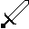
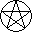
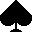
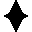
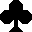

# Pet Rock

A EuroPi clone of [Johan Senzel's Pet Rock](https://petrock.site/).

This script generates pseudo-random gate sequences based on the phase of the moon.

## I/O Assignments

- `din`: external clock input for sequence A
- `ain`: external clock input for sequence B
- `b1`: manually advance sequence A
- `b2`: manually advance sequence B
- `k1`: speed control for sequence A
- `k2`: speed control for sequence B
- `cv1`: primary gate output for sequence A
- `cv2`: inverted gate output for sequence A
- `cv3`: end of sequence trigger for sequence A
- `cv4`: primary gate output for sequence B
- `cv5`: inverted gate output for sequence B
- `cv6`: end of sequence trigger for sequence B

Both sequence A and sequence B can be internally clocked by setting the speed using `K1` and `K2`.
Turning these knobs fully anticlockwise will stop the internal clocks.

## Configuration

Pet Rock can be configured to use different pseudo-random rhythm-generating algorithms. To choose,
edit `config/PetRock.json` to set the `MOODS` key:
```json
{
    "MOODS": "classic"
}
```

- `MOODS` can be one of `classic` (default), `alternate`, or `all`

Depending on the `MOODS` configured, the following algorithms are used, cycling every new moon:

**Classic**
-  Plain
-  Reich
-  Sparse
-  Vari

**Alternate**

These algorithms were implemented in the original Pet Rock firmware, but ultimately not used in the
final release.
-  Blocks
-  Culture
-  Over
-  Wonk

**All**

When `"all"` moods are selected, the order is the 4 classic algorithms, followed by the 4 alternate
algorithms, in the order listed above.


### Note on suits

Yes, I'm aware that "shields" isn't a normal Tarot suit. Originally I used "clubs" (an alternative
to the traditional "wands" suit in most tarot decks). But it seemed weird having 3/4 English card
suits used for the alternate moods, and then have "shields" tossed-in to fill it out; "shields" is
a suit more associated with Swiss playing cards.

Since shields and swords are a natural pairing, I swapped things around to have, in my mind, more
logical groupings. I'm sorry if this decision causes anyone distress.

Additionally, I realize the "pentacle" symbol has some negative associations for some. No offense
is meant; this is a traditional suit in tarot cards, and felt appropriate for a moon-phase-tracking
program. I did consider swapping it for its "coins" alternative, but was concerned that a circular
or elliptical coin motif might be too visually similar to the full & gibbous moon icons.


## Required Hardware

This script requires a Realtime Clock (RTC) to EuroPi's secondary I2C header pins,
located on the underside of the board.

See [Realtime Clock Installation](/software/realtime_clock.md) for instructions on
installing and configuring the realtime clock.
