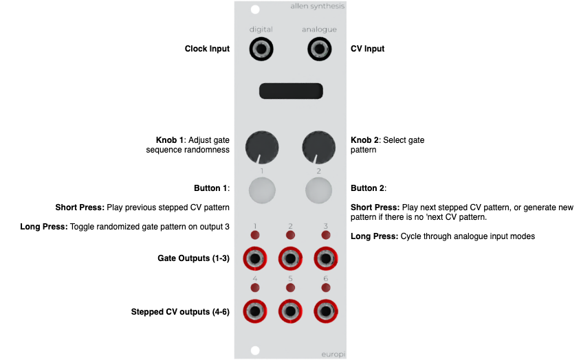

# EuroPi Consequencer - An open source sequencer and random source power house!

author: Nik Ansell (github.com/gamecat69)

date: 2022-02-09

labels: sequencer, gates, triggers, drums, randomness

Consequencer is a gate and stepped CV sequencer inspired by Grids from Mutable Instruments and the randomness created by the Turing Machine.
Pattern changes and randomness are introduced as a consequence of both manual input and control voltages sent to the analogue input.
A large number of popular gate patterns are pre-loaded. Stepped CV sequences are automatically generated.

Both gate patterns and CV sequences can be smoothly morphed between without disrupting playback.
Use outputs 1 - 3 for gates and outputs 4 - 6 for randomised stepped CV patterns.
Send a clock to the digital input to start the sequence.

Demo video: https://youtu.be/UwjajP6uiQU

Credits:
- The Europi hardware and firmware was designed by Allen Synthesis: https://github.com/Allen-Synthesis/EuroPi
- A small number of preload drum patterns were recreated from here: https://docs.google.com/spreadsheets/d/19_3BxUMy3uy1Gb0V8Wc-TcG7q16Amfn6e8QVw4-HuD0/edit#gid=0

# Controls



- digital_in: Clock in
- analog_in: Mode 1: Adjusts randonmess, Mode 2: Selects gate pattern, Mode 3: Selects stepped CV pattern

- knob_1: Adjust randomness
- knob_2: Select pre-loaded gate pattern

- button_1: Short Press: Toggle randomized pattern on output 3 on / off. Long Press: Play previous stepped CV sequence
- button_2: Short Press: Generate a new random stepped cv sequence for outputs 4 - 6. Long Press: Cycle through analogue input modes

- output_1: gate 1 e.g Kick Drum
- output_2: gate 2 e.g Snare Drum
- output_3: gate 3 e.g Hi-Hat
- output_4: randomly generated stepped CV
- output_5: randomly generated stepped CV
- output_6: randomly generated stepped CV

# Building a Consequencer module

Consequencer is software which is loaded onto a Europi module. Europi is an open-source hardware and software project found here: https://github.com/Allen-Synthesis/EuroPi.
Consequencer is also open-source, all code can be found in this repository and license terms can be found at the bottom of this document.

To build your own Consequencer:
1. Build a module and load the europi firmware onto the module using the instructions in the above repository
2. Copy consequencer.py as main.py and consequencer_patterns.py to the Europi

Alternatively, Consequencer Europi modules can be provided built, calibrated and pre-loaded with software and drum patterns by contacting nikansell00@gmail.com.

# Getting Started

The following sections provide instructions for creating a simple 3 drum pattern with a kick, snare and hi-hat, then using random CV patterns to vary the timbre in each drum pattern.
You can of course connect outputs 1 - 3 to any module which expects gates and outputs 4 - 6 to any module expecting a control voltage.

## Basic Usage
1. Connect a clock input to the Digital input
2. Connect a Bass Drum to output 1, Snare to output 2 and Hi-hat to output 3
3. Start your clock - a pattern will output gates on outputs 1 -3
4. Select different patterns manually using knob 2 (right-hand knob). The selected pattern is shown visually on the screen.

## Adding randomness
1. A long-press and release of button 1 toggles on/off the real-time generation of a random gate pattern to output 3
2. Knob 1 increases or decreases the randomness of the patterns sent to outputs 1 -3
3. Randomness can also be controlled by sending CV to the analogue input if analogInputMode 1 is selected (default).

## Using random CV from outputs 4 - 6

Outputs 4 - 6 provide a random pattern of stepped CV which is sync'd with the inbound clock.
A short-press and release of button 2 will generate a new pattern for all 3 outputs.

Example usage for these CV outputs, (this will depend on the inputs your drum module has):
- Snare Decay
- Hi-Hat decay (simulate an open hi-hat)
- Hi-Hat pitch
- Velocity
- Kick decay
- Kick accent
- Send stepped CV into the cutoff frequencer of a VCF (Voltage Controlled Filter)
- Send stepped CV into a quantizer, then feed the quantized output into a VCO (Voltage Controlled Oscillator)

## Selecting analogue input modes

Consequencer can perform 3 different actions when a control voltage input is received at the analogue input.
The current running mode is shown on the bottom right of the screen (e.g. M1, M2, M3)
Cycle through the modes by long-pressing and releasing button 2. Tbe following modes are available:

- Mode 1: Control voltage adjusts randomness of the gate patterns sent to outputs 1 - 3
- Mode 2: Control voltage selects the gate pattern
- Mode 3: Control voltage selects the stepped CV pattern

## Controlling a pattern using CV

1. Select analogue mode 2.
2. Send a control voltage into the analogue input

A fixed voltage will select a single pattern and varying voltage (e.g. an envelope or LFO) will smoothly cycle through patterns.

## Adding / Removing / Updating Gate Patterns

1. Update consequencer_patterns.py
2. Restart the Europi module, or restart the program if using a micropython IDE/CLI

The syntax should be intuitive. A four-on-the-floor exanmple pattern is shown below. Each `1` or `0` represents a gate or no gate at that point in the sequence.
The mapping of `BD`, `SN`, `HH` is as follows:
- BD: Output 1
- SN: Output 2
- HH: Output 3

```
    BD.append("1000100010001000")
    SN.append("0000100000001000")
    HH.append("1111111111111111")
```

# Known bugs / Interesting features

A small amount of noise causes the analogue input to vary slightly. This can sometimes cause the randomness, gate pattern or stepped CV pattern to flicker between values. It happens only occassionally, but introduces an interesting and subtle variation to the sequence being played.

# License

Consequencer, like the Europi module, and any documentation included in this repository, is entirely "free" software and hardware, under different licenses depending on the software, hardware, and documentation itself.

* Software: [Apache 2.0](software/LICENSE)
* Hardware: [CERN OHL-S v2](hardware/LICENSE)
* Documentation: [CC0 1.0](LICENSE)